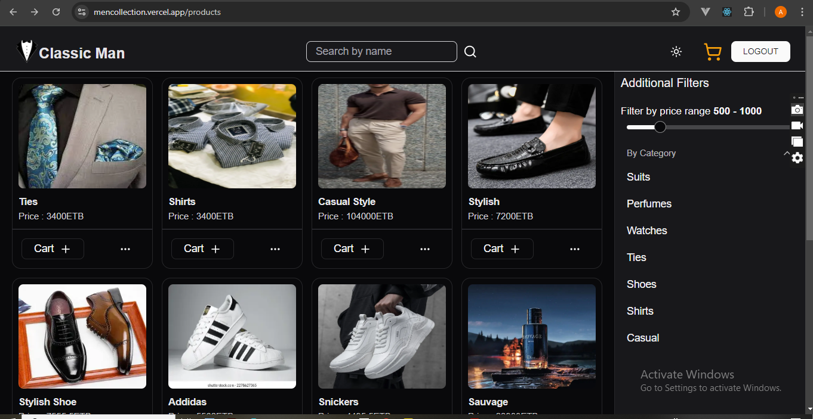

# 🕴️ Classic Men's Collection – E-commerce Platform

An elegant and modern **men's fashion e-commerce platform** built with **Next.js, Tailwind CSS, and Prisma**, designed to showcase and manage high-quality men's fashion products with a **clean, responsive user experience**.

This platform allows **browsing products, placing orders (without payment integration), and admin management of products** with secure authentication using **Better-Auth**.

---

## 🚀 Features

### 🛍️ User Features

* **Product Catalog** – Browse men's fashion categories (suits, shirts, accessories) with filtering.
* **Product Details** – View high-resolution images, descriptions, and prices.
* **Order Placement** – Add products to the cart and place orders (no payment integration yet).
* **Authentication** – Secure signup and login using Better-Auth.
* **Responsive Design** – Optimized for desktop, tablet, and mobile devices.

### 🛠️ Admin Features

* **Product Management** – Add, edit, and delete products with images and category assignment.
* **Dashboard View** – Track and manage product listings and orders.

---

## 💡 Tech Stack

* **Frontend:** Next.js, React, Tailwind CSS, Shadcn/UI
* **State Management:** Zustand
* **Backend:** Next.js App Router API Routes
* **Auth:** Better-Auth
* **Database:** PostgreSQL (via Neon) with Prisma ORM
* **Storage:** Vercel Blob Storage for product images
* **Deployment:** Vercel

---

## 📸 Live Preview

[🌐 Visit the Live Site](https://mencollection.vercel.app/)

---

## ⚙️ Installation

### 1️⃣ Clone the Repository

```bash
git clone https://github.com/Andu-alem/Men-collection.git
cd Men-collection
```

### 2️⃣ Install Dependencies

```bash
pnpm install
```

### 3️⃣ Set Up Environment Variables

Create a `.env.local` file in the root:

```
DATABASE_URL=<your-neon-postgres-url>
BLOB_READ_WRITE_TOKEN=<your-vercel-blob-token>
NEXT_PUBLIC_BLOB_READ_TOKEN=<your-vercel-blob-read-token>
NEXTAUTH_SECRET=<your-nextauth-secret>
NEXTAUTH_URL=<your-app-url>
```

*(Add other Better-Auth and required env variables as applicable.)*

---

### 4️⃣ Run the Development Server

```bash
pnpm dev
```

Access the app at: [http://localhost:3000](http://localhost:3000)

---

## 🧩 Roadmap

* [x] Product catalog with filtering
* [x] Admin product CRUD management
* [x] Order placement functionality
* [x] Authentication with Better-Auth
* [ ] Payment integration
* [ ] User order history UI

## Screenshots



## Contributing

Contributions are welcome! To contribute:

1.  Fork the repository.
2.  Create a feature branch (`git checkout -b feature-name`).
3.  Submit a pull request.

---

## 📜 License

This project is licensed under the [MIT License](LICENSE).

---

## 📫 Contact

* **Portfolio:** [andudev.netlify.app](https://andudev.netlify.app)
* **Email:** [Your Email](mailto:andualem.fereja12@gmail.com)

---

### 🙏 Thank you for visiting!

Feel free to explore the code, give feedback, or reach out if you’d like to collaborate on building impactful projects together.

---
